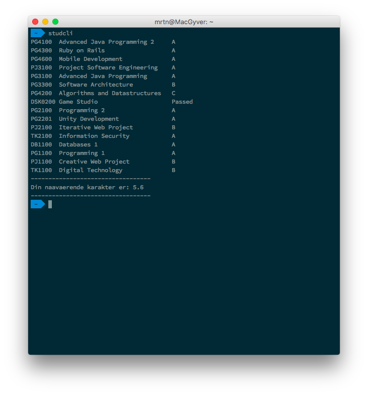

# Command Line Interface Studweb
### By Martin Ingesen

##### Studcli was created because I was tired of manually navigating to Studweb to see if I had gotten my grades yet.
Hench why studcli was born, now you can easily call a python-command, and all your grades will be printed out and formatted in a nice way!



## How to use
1. Make sure you have Python installed
2. Install splinter via pip
3. Download the script.
4. Edit birthnumber and pincode, save
5. Run main.py using the python-command
6. (optionally) add ```alias studweb="python /path/to/studcli/main.py"``` in your zshconfig, so that you can run ```studweb``` from terminal

## Disclaimer
I made this for my own sake, and it may or may not work on your studweb. 